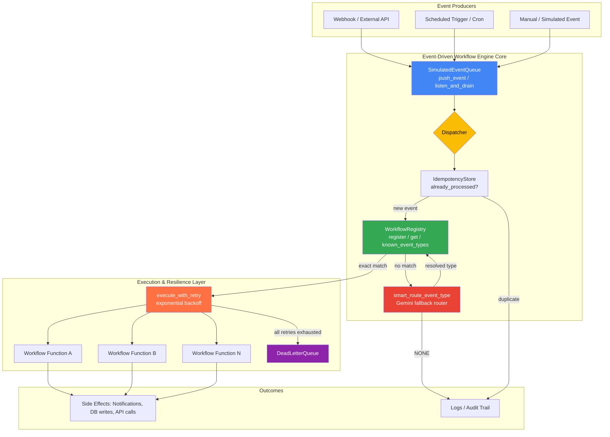
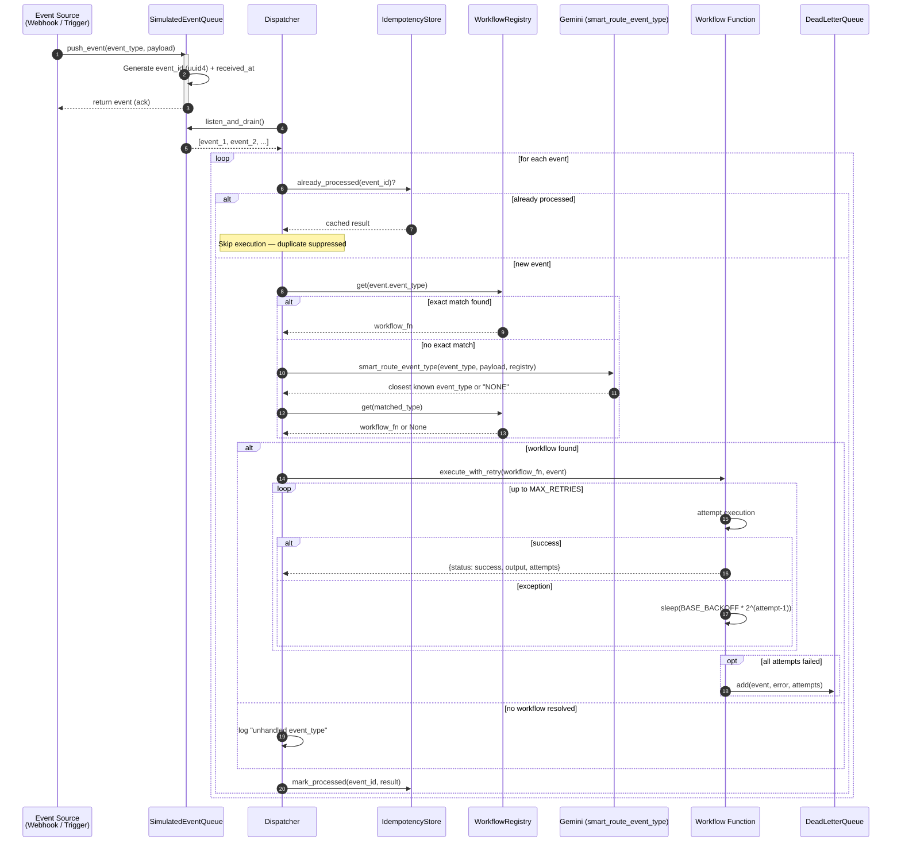
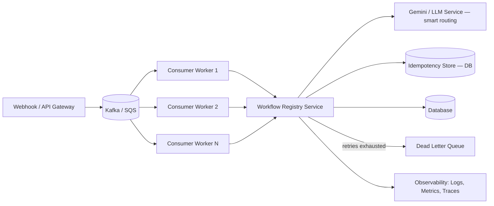

# ⚡ Event-Driven Workflow Engine

**A Python-based simulation of a modern event-driven automation system** — event queues, webhook-style listeners, a self-healing workflow registry, and an LLM-powered decision layer (Google Gemini via LangChain) built from first principles to demonstrate how real production systems like AWS EventBridge, Kafka consumers, Temporal, and n8n work under the hood.

<p align="left">
  
  
  
  
  
</p>

> **Repository:** [`techakash32/Event-Driven-Workflow-Engine`](https://github.com/techakash32/Event-Driven-Workflow-Engine)
> **Author:** Akash Nagar

---

## 📑 Table of Contents

1. [Project Overview](#-project-overview)
2. [Why This Project Matters](#-why-this-project-matters)
3. [System Architecture](#-system-architecture)
4. [Event Lifecycle](#-event-lifecycle)
5. [Workflow Execution Model](#-workflow-execution-model)
6. [Resilience Layer: Smart Routing, Idempotency, Retries & DLQ](#-resilience-layer-smart-routing-idempotency-retries--dlq)
7. [Project Structure](#-project-structure)
8. [Installation & Setup](#-installation--setup)
9. [Usage Guide](#-usage-guide)
10. [Technology Stack](#-technology-stack)
11. [Code Walkthrough (Component by Component)](#-code-walkthrough-component-by-component)
12. [Design Patterns Used](#-design-patterns-used)
13. [Scalability & Production Considerations](#-scalability--production-considerations)
14. [Roadmap / Future Improvements](#-roadmap--future-improvements)
15. [Real-World Use Cases](#-real-world-use-cases)
16. [Interview Preparation — 40 Q&A](#-interview-preparation--40-qa)
17. [Contributing](#-contributing)
18. [License](#-license)

---

## 🧭 Project Overview

The **Event-Driven Workflow Engine** is a lightweight, educational-yet-extensible simulation of an event-driven automation platform, written in pure Python. It models the same core primitives that power tools like **Zapier, n8n, AWS EventBridge, Temporal, and Airflow**, but strips them down to their essence so that every moving part is visible and explainable:

- An **Event Queue** that receives and buffers events (simulating a message broker such as Kafka/SQS/RabbitMQ).
- A **Workflow Registry** that maps event types to the functions ("workflows") that should run when those events occur (the publish–subscribe pattern).
- A **Gemini smart-router** that rescues events whose `event_type` doesn't exactly match anything registered (e.g. a producer sends `order-created` instead of `order.created`), using the LLM to find the closest known type instead of silently dropping the event.
- An **Idempotency Store** that prevents the same event from being executed twice.
- **Retry-with-exponential-backoff** logic that gives a flaky workflow multiple chances before giving up.
- A **Dead Letter Queue (DLQ)** that catches events which exhaust every retry, so nothing fails silently.

The project is intentionally built in layers — beginners can read `main.py` top to bottom and understand exactly how an event goes from "received" to "handled," while advanced readers can use it as a scaffold to bolt on a real broker (Kafka/Redis), a persistent workflow store, and horizontal scaling.

### What problem does it solve?

Traditional request/response systems couple the *producer* of an action (a user click, an API call, a file upload) directly to the *consumer* that reacts to it. That coupling makes systems brittle, hard to scale, and hard to extend. This project demonstrates the inversion: **producers only emit events; consumers (workflows) subscribe independently.** Adding a new reaction to an existing event never requires touching the code that raised the event in the first place — a core tenet of Event-Driven Architecture (EDA). On top of that core inversion, it demonstrates the failure-handling machinery every production event system eventually needs: **duplicate suppression, retries, and a safety net for permanently failing work.**

---

## 💡 Why This Project Matters

| Angle | What it demonstrates |
|---|---|
| **System Design** | Decoupled producer/consumer architecture, the backbone of every modern distributed system |
| **Reliability Engineering** | Idempotency, retry-with-backoff, and Dead Letter Queues — the exact failure-handling patterns used in production message-driven systems |
| **Software Engineering** | Clean class design, single-responsibility components, registry/factory patterns |
| **AI Engineering** | Practical integration of an LLM (Gemini) into an automation pipeline for fuzzy event-type routing, not just text generation |
| **Interview Readiness** | Talking points for EDA, queues, webhooks, workflow engines, and reliability patterns — common in SDE/Backend/AI interviews |
| **Extensibility** | A minimal core that can grow into a Kafka-backed, horizontally scaled orchestration service |

---

## 🏗 System Architecture

At a high level, the engine has five cooperating components: an **Event Source** (webhook/API/simulated trigger), the **Event Queue**, the **Workflow Registry** (with a **Gemini smart-router** fallback), the **Retry + Idempotency layer**, and the **Dead Letter Queue** for anything that can't be handled.



**Reading the diagram:**
1. Any producer (a webhook call, a cron job, or a manually simulated trigger) calls `push_event()` on the queue.
2. The dispatcher drains the queue and, for each event, first checks the `IdempotencyStore` — if this `event_id` was already processed, its cached result is reused and no workflow runs again.
3. For new events, the dispatcher looks up an exact `event_type` match in the `WorkflowRegistry`. If nothing matches, `smart_route_event_type()` asks Gemini to find the closest known event type before giving up.
4. The matched workflow runs inside `execute_with_retry()`, which retries transient failures with exponential backoff.
5. If every retry attempt fails, the event is moved to the `DeadLetterQueue` for later inspection instead of being lost.

---

## 🔄 Event Lifecycle

Every event now passes through **seven** stages instead of a simple emit → execute flow: **Emit → Queue → Dispatch → Idempotency Check → Route (exact or Gemini-assisted) → Execute-with-Retry → Complete (or Dead-Letter)**.



**Lifecycle stages explained:**

| Stage | Component | Responsibility |
|---|---|---|
| **1. Emit** | Producer (webhook/trigger) | Something happens in the world and is translated into a structured event |
| **2. Queue** | `SimulatedEventQueue` | Event is buffered with a unique `event_id` and timestamp; decouples producer from consumer in time |
| **3. Dispatch** | Dispatcher loop | Queue is drained for processing |
| **4. Idempotency Check** | `IdempotencyStore` | Skips events whose `event_id` was already processed, reusing the cached result |
| **5. Route** | `WorkflowRegistry` + `smart_route_event_type` | Exact match first; Gemini-assisted fuzzy match as a fallback for mismatched event names |
| **6. Execute-with-Retry** | `execute_with_retry` | Runs the workflow, retrying transient failures with exponential backoff |
| **7. Complete / Dead-Letter** | `DeadLetterQueue` | Successful results are cached; permanently failing events are quarantined for inspection |

---

## ⚙️ Workflow Execution Model

A **workflow** in this engine is simply a Python callable registered against an `event_type` string. This is the classic **publish–subscribe** model:

```python
def handle_new_signup(payload: dict) -> str:
    """Workflow triggered when a 'user.signup' event occurs."""
    name = payload.get("name", "user")
    return f"Welcome message sent to {name}"

workflow_registry.register("user.signup", handle_new_signup)
```

When an event with `event_type == "user.signup"` is drained from the queue, the dispatcher calls `workflow_registry.get("user.signup")`, receives `handle_new_signup`, and executes it (wrapped in retry logic) with the event's `payload`. Because the registry is a simple dictionary lookup, matching is **O(1)** regardless of how many workflows are registered.

The three demo workflows shipped in `main.py`:

| Event Type | Workflow Function | Behavior |
|---|---|---|
| `order.created` | `workflow_send_order_confirmation` | Always succeeds; returns a confirmation message |
| `payment.failed` | `workflow_notify_payment_failure` | Deliberately flaky — raises `RuntimeError` ~60% of the time, to exercise the retry logic |
| `user.signup` | `workflow_send_welcome_message` | Always succeeds; returns a welcome message |

### One event, many workflows

Real systems often need to react to the same event in multiple independent ways (e.g., "order.placed" should both send a confirmation email *and* update inventory). The registry can be extended from a single-function map to a **list of subscribers per event type**, which is exactly how production pub/sub systems (SNS fan-out, Kafka consumer groups) behave — see [Roadmap](#-roadmap--future-improvements).

---

## 🛡 Resilience Layer: Smart Routing, Idempotency, Retries & DLQ

This is what separates the engine from a toy dispatcher — four cooperating safety mechanisms that mirror how production event systems actually stay reliable.

### 1. Gemini Smart Routing

```python
def smart_route_event_type(event_type, payload, registry):
    known = registry.known_event_types()
    prompt = f'''A system received an event with type "{event_type}" and payload {payload}.
Known workflow event types are: {known}
Which known event type is this closest to? Respond with ONLY the exact matching
string from the known list, or "NONE" if nothing fits.'''

    raw_content = llm.invoke(prompt).content
    guess = raw_content.strip() if isinstance(raw_content, str) else "".join(
        part.get("text", "") if isinstance(part, dict) else str(part)
        for part in raw_content
    ).strip()

    return guess if guess in known else None
```

Upstream producers are never perfectly consistent — a webhook might send `order-created` (hyphen) instead of `order.created` (dot). Rather than dropping that event, the dispatcher asks Gemini to pick the closest known event type. This is a genuinely practical use of an LLM inside infrastructure code: **fuzzy matching against a small, known vocabulary** — a task well suited to a fast, cheap model rather than brittle string-similarity heuristics.

> **Note:** Gemini's newer models can return `.content` as a list of content blocks instead of a plain string. The code above defensively handles both shapes — see [Q39](#-interview-preparation--40-qa) for why this matters.

### 2. Idempotency Store

```python
class IdempotencyStore:
    def already_processed(self, event_id): ...
    def get_cached_result(self, event_id): ...
    def mark_processed(self, event_id, result): ...
```

Message brokers commonly guarantee **at-least-once delivery** — meaning the same event can legitimately arrive twice. Without this store, a redelivered `payment.failed` event could trigger a duplicate customer notification. The store keys results by `event_id`, so redelivery becomes a safe no-op.

### 3. Retry with Exponential Backoff

```python
MAX_RETRIES = 3
BASE_BACKOFF_SECONDS = 0.5

def execute_with_retry(workflow_fn, event, dlq, max_retries=MAX_RETRIES):
    for attempt in range(1, max_retries + 1):
        try:
            return {"status": "success", "output": workflow_fn(event["payload"]), "attempts": attempt}
        except Exception as e:
            last_error = str(e)
        time.sleep(BASE_BACKOFF_SECONDS * (2 ** (attempt - 1)))
    dlq.add(event, last_error, max_retries)
    return {"status": "dead_lettered", "error": last_error, "attempts": max_retries}
```

Backoff doubles after each failed attempt (`0.5s → 1.0s → 2.0s`), which avoids hammering a downstream dependency that's already struggling — the same principle behind AWS SDK retries, gRPC backoff policies, and Kafka consumer retry topics.

### 4. Dead Letter Queue

```python
class DeadLetterQueue:
    def add(self, event, error, attempts): ...
    def list_items(self): ...
    def remove(self, event_id): ...
```

If `payment.failed`'s simulated flakiness (60% failure chance) causes all `MAX_RETRIES` attempts to fail, the event lands in the DLQ with its error and attempt count preserved — instead of being retried forever or silently discarded. In production, a DLQ is typically monitored/alerted on separately so an engineer can inspect and manually replay or discard the poison event.

---

## 📁 Project Structure

```
Event-Driven-Workflow-Engine/
├── main.py               # Core engine: queue, registry, smart routing, idempotency, retry/DLQ, LLM setup
├── requirements.txt       # Python dependencies (langchain, langchain-google-genai, python-dotenv, etc.)
├── pyproject.toml         # Project metadata / packaging configuration
├── .python-version        # Pinned Python version for consistent environments
├── .gitignore              # Excludes .env, __pycache__, virtual envs, etc.
└── README.md               # Project documentation (this file)
```

| File | Purpose |
|---|---|
| `main.py` | Contains `SimulatedEventQueue`, `WorkflowRegistery`, `smart_route_event_type`, demo workflows, `IdempotencyStore`, `DeadLetterQueue`, `execute_with_retry`, and Gemini LLM initialization |
| `requirements.txt` | Dependency list installed via `pip install -r requirements.txt` |
| `pyproject.toml` | Modern Python packaging metadata (build system, project name, version) |
| `.python-version` | Ensures tools like `pyenv` select the correct interpreter version |
| `.env` *(not committed)* | Holds `GOOGLE_API_KEY` — loaded via `python-dotenv` |

---

## 🛠 Installation & Setup

### Prerequisites

- Python **3.10+**
- A **Google AI Studio API key** for Gemini ([get one here](https://aistudio.google.com/apikey))
- `pip` for dependency management

### Step-by-step

```bash
# 1. Clone the repository
git clone https://github.com/techakash32/Event-Driven-Workflow-Engine.git
cd Event-Driven-Workflow-Engine

# 2. Create and activate a virtual environment
python -m venv venv
source venv/bin/activate        # macOS / Linux
venv\Scripts\activate           # Windows

# 3. Install dependencies
pip install -r requirements.txt

# 4. Configure your environment variables
echo "GOOGLE_API_KEY=your_api_key_here" > .env

# 5. Run the engine
python main.py
```

### Expected output

```
[Workflow-registery] registered workflow for event_type = 'order.created'
[Workflow-registery] registered workflow for event_type = 'payemnt.failed'
[Workflow-registery] registered workflow for event_type = 'user.signup'
Queue Set up is ready ....

Registerd workflow: ['order.created', 'payemnt.failed', 'user.signup']
idempotency_ready
Retry + Dead Letter Queue logic ready
```

> **Model note:** the engine uses `gemini-3.5-flash-lite` — Google's current low-cost, high-throughput GA model, well suited to short classification/routing prompts like `smart_route_event_type`. Older model strings such as `gemini-2.5-flash` may return `404` for newer API keys as Google rotates its default lineup; check [ai.google.dev/gemini-api/docs/models](https://ai.google.dev/gemini-api/docs/models) if you hit that error.

---

## 📘 Usage Guide

### 1. Emitting an event

```python
from main import event_queue

event_queue.push_event(
    event_type="user.signup",
    payload={"name": "Akash"},
)
```

### 2. Registering a workflow

```python
from main import workflow_registry

def handle_signup(payload: dict) -> str:
    name = payload.get("name", "user")
    return f"Welcome message sent to {name}"

workflow_registry.register("user.signup", handle_signup)
```

### 3. Dispatching with the full resilience stack

```python
from main import (
    event_queue, workflow_registry, smart_route_event_type,
    idempotency_store, execute_with_retry, dlq,
)

def dispatch_all():
    for event in event_queue.listen_and_drain():
        event_id, event_type = event["event_id"], event["event_type"]

        if idempotency_store.already_processed(event_id):
            continue  # duplicate delivery — safely skipped

        workflow_fn = workflow_registry.get(event_type)
        if workflow_fn is None:
            matched = smart_route_event_type(event_type, event["payload"], workflow_registry)
            workflow_fn = workflow_registry.get(matched) if matched else None

        result = (
            execute_with_retry(workflow_fn, event, dlq)
            if workflow_fn
            else {"status": "unhandled", "attempts": 0}
        )
        idempotency_store.mark_processed(event_id, result)

# Example run
event_queue.push_event("order-created", {"order_id": "A1002"})  # mismatched type -> Gemini smart-routes it
dispatch_all()
```

This mirrors exactly how a real consumer loop works against Kafka, SQS, or RabbitMQ: **pull → dedupe → match (or fuzzy-match) → retry-protected execute → dead-letter on exhaustion.**

---

## 🧩 Technology Stack

| Layer | Technology | Role |
|---|---|---|
| Language | **Python 3.10+** | Core implementation language |
| LLM Orchestration | **LangChain** (`langchain`) | Abstraction layer for prompting, chaining, and tool use |
| LLM Provider | **Google Gemini** (`gemini-3.5-flash-lite` via `langchain-google-genai`) | Fuzzy event-type routing inside `smart_route_event_type` |
| SDK | **google-generativeai** | Underlying Gemini SDK used by the LangChain integration |
| Data Handling | **pandas** | Structured data manipulation for workflow payloads |
| Config Management | **python-dotenv** | Loads `GOOGLE_API_KEY` and other secrets from `.env` |
| Concurrency Primitive | **`queue.Queue`** (standard library) | Thread-safe in-memory event buffer |
| Identifiers | **`uuid`** (standard library) | Generates unique `event_id` per event |
| Time Handling | **`datetime` / `time`** (standard library) | Timestamps events and drives retry backoff delays |
| Randomness | **`random`** (standard library) | Simulates a flaky downstream service in the demo `payment.failed` workflow |
| Packaging | **`pyproject.toml`** | Modern Python project metadata |

---

## 🔍 Code Walkthrough (Component by Component)

### `SimulatedEventQueue`

```python
class SimulatedEventQueue:
    def __init__(self):
        self._queue = queue.Queue()

    def push_event(self, event_type, payload, event_id=None):
        event = {
            "event_id": event_id or str(uuid.uuid4()),
            "event_type": event_type,
            "payload": payload,
            "received_at": datetime.now().strftime("%Y-%m-%d %H:%M:%S"),
        }
        self._queue.put(event)
        return event

    def listen_and_drain(self):
        events = []
        while not self._queue.empty():
            events.append(self._queue.get())
        return events

    def is_empty(self):
        return self._queue.empty()
```

**What it does and why it's designed this way:**
- Wraps Python's built-in, **thread-safe** `queue.Queue` — the same primitive used to build producer/consumer pipelines and worker pools.
- `push_event` is the **write path**: it normalizes any incoming trigger into a consistent event envelope (`event_id`, `event_type`, `payload`, `received_at`), which is exactly what real message brokers do (Kafka message headers, SQS message attributes, CloudEvents spec).
- Generating `event_id` with `uuid.uuid4()` guarantees a globally unique, collision-resistant identifier without needing a central coordinator — critical in distributed systems, and the same identifier the `IdempotencyStore` later keys on.
- `listen_and_drain` is the **read path**: it fully empties the queue into a list, simulating a consumer "polling" a broker in batches (similar to `SQS.receive_message` with a batch size, or a Kafka `poll()` call).

### `WorkflowRegistery`

```python
class WorkflowRegistery:
    def __init__(self):
        self._workflows: Dict[str, Callable] = {}

    def register(self, event_type, workflow_fn):
        self._workflows[event_type] = workflow_fn

    def get(self, event_type):
        return self._workflows.get(event_type)

    def known_event_types(self):
        return list(self._workflows.keys())
```

**What it does and why it's designed this way:**
- Implements the **publish–subscribe (observer) pattern** at the code level: producers never know which function will run — only the `event_type` string. This is the same decoupling principle behind `EventEmitter` in Node.js, Django signals, and AWS EventBridge rules.
- Uses a `Dict[str, Callable]` for **O(1) average-case lookup**, so exact-match dispatch latency stays flat no matter how many workflows are registered.
- `known_event_types()` doubles as the **vocabulary Gemini is given** in `smart_route_event_type` — the LLM is explicitly constrained to only ever return a string from this list (or `"NONE"`), which keeps the fuzzy-routing step bounded and predictable rather than open-ended generation.

### `smart_route_event_type` — the Gemini fallback router

```python
def smart_route_event_type(event_type, payload, registry):
    known = registry.known_event_types()
    prompt = f'''...respond with ONLY the exact matching string from the known
list, or "NONE" if nothing fits.'''

    raw_content = llm.invoke(prompt).content
    if isinstance(raw_content, str):
        guess = raw_content.strip()
    else:
        guess = "".join(
            part.get("text", "") if isinstance(part, dict) else str(part)
            for part in raw_content
        ).strip()

    return guess if guess in known else None
```

**What it does and why it's designed this way:**
- Only invoked as a **fallback** — exact `dict` lookup is always tried first, since it's free and instant. The LLM call is reserved for the case that actually needs semantic judgment.
- The prompt constrains Gemini to respond with **only** a string from a closed vocabulary (or `"NONE"`), turning an otherwise open-ended generative call into something closer to a **classification** task — this keeps output parsing simple and the failure mode predictable.
- The `isinstance` branch defensively handles both response shapes Gemini's SDK can return: a plain string (older models) or a list of content blocks (newer models can split output into text/thought parts). Without this, `.strip()` on a list raises `AttributeError: 'list' object has no attribute 'strip'`.
- Returning `None` (rather than raising) when nothing matches lets the dispatcher treat "no workflow found" as a normal, loggable outcome instead of an exception to catch.

### Idempotency, Retry & Dead Letter Queue

Covered in detail in [Resilience Layer](#-resilience-layer-smart-routing-idempotency-retries--dlq) above — together these three components (`IdempotencyStore`, `execute_with_retry`, `DeadLetterQueue`) turn a fragile "call the function and hope" dispatcher into one that tolerates duplicate delivery, transient failures, and permanent failures without crashing or losing events.

### Gemini LLM Setup

```python
load_dotenv()
api_key = os.environ.get("GOOGLE_API_KEY")
if not api_key:
    api_key = getpass.getpass("Enter your Google API key: ")
    os.environ["GOOGLE_API_KEY"] = api_key

llm = ChatGoogleGenerativeAI(
    model="gemini-3.5-flash-lite",
    temperature=0.2,
    google_api_key=api_key,
)
```

**What it does and why it's designed this way:**
- `python-dotenv` keeps secrets **out of source control** — the `.env` file is git-ignored, following the [Twelve-Factor App](https://12factor.net/config) principle of storing config in the environment.
- The `getpass` fallback means the script still runs interactively (e.g. in a notebook) even without a `.env` file present, without ever echoing the key to the terminal.
- `temperature=0.2` biases the model toward consistent, low-variance output — appropriate for a classification-style task like event-type routing where reproducibility matters more than creative variety. (Note: Gemini 3.x models currently accept but ignore sampling parameters like `temperature`; Google has signaled they may become an error in a future model generation, so treat this as an intentionally documented, easily-removable setting.)
- `ChatGoogleGenerativeAI` is LangChain's standard chat-model interface, meaning `llm` is a drop-in replacement for any other LangChain-supported model (OpenAI, Anthropic, etc.) — `smart_route_event_type` doesn't need to change if the model provider changes.

---

## 🧠 Design Patterns Used

| Pattern | Where It Appears | Why It's Used |
|---|---|---|
| **Publish–Subscribe (Observer)** | `WorkflowRegistery` + event dispatch | Decouples event producers from the code that reacts to them |
| **Registry Pattern** | `WorkflowRegistery._workflows` dict | Central lookup table mapping keys → behavior, enabling dynamic registration |
| **Producer–Consumer** | `SimulatedEventQueue` | Separates the rate/timing of event creation from event processing |
| **Chain of Responsibility** | Exact match → Gemini smart-route → unhandled | Each routing strategy gets a chance to resolve the event before falling through to the next |
| **Retry Pattern (Exponential Backoff)** | `execute_with_retry` | Gives transient failures multiple chances before giving up, spacing attempts to avoid overwhelming a struggling dependency |
| **Dead Letter Queue** | `DeadLetterQueue` | Quarantines permanently-failing work instead of losing it or retrying forever |
| **Idempotent Receiver** | `IdempotencyStore` | Makes redelivery of the same event safe, a prerequisite for at-least-once delivery systems |
| **Fail-Fast** | `GOOGLE_API_KEY` validation before LLM use | Surfaces configuration errors immediately instead of at runtime deep in a workflow |
| **Strategy Pattern (extension point)** | Each registered workflow function | Interchangeable "strategies" selected at runtime by `event_type` |

---

## 📈 Scalability & Production Considerations

The current implementation is intentionally in-memory and single-process — perfect for learning and prototyping — but it now includes several patterns (idempotency, retries, DLQ) that carry over almost unchanged to a production deployment. The table below separates what's already solved from what still needs a distributed-systems upgrade:

| Concern | Current Behavior | Production-Grade Approach |
|---|---|---|
| **Durability** | Events live in an in-memory `queue.Queue`; a crash loses unprocessed events | Back the queue with **Kafka, AWS SQS, RabbitMQ, or Redis Streams** for durability and replay |
| **Idempotency** | ✅ Solved — `IdempotencyStore` keys results by `event_id` | Same concept, backed by a database with a unique constraint instead of an in-memory dict (so it survives restarts) |
| **Transient Failure Handling** | ✅ Solved — `execute_with_retry` with exponential backoff | Same pattern; production systems often add jitter to backoff to avoid retry storms across many consumers |
| **Permanent Failure Handling** | ✅ Solved — `DeadLetterQueue` captures exhausted events | Same concept, backed by a durable DLQ topic/queue with alerting so a human is notified |
| **Fuzzy Event Routing** | ✅ Solved — Gemini-assisted matching against a closed vocabulary | Same pattern; consider caching repeated `event_type` → resolved-type mappings to avoid a paid LLM call for a name you've already resolved once |
| **Concurrency** | Single-threaded dispatch loop | Use a **worker pool** (multiprocessing, asyncio, or Celery workers) to process events in parallel |
| **Horizontal Scaling** | One process, one queue | Multiple consumer instances in a **consumer group** so events are load-balanced across workers |
| **Ordering guarantees** | FIFO within a single `queue.Queue` | Use **partition keys** (e.g., per-user ordering in Kafka) if strict ordering per entity is required |
| **Observability** | `print()` statements | Structured logging, **distributed tracing** (OpenTelemetry), and metrics (Prometheus) per event/workflow |
| **Schema Evolution** | Plain `dict` payloads | Formal schemas (**Pydantic models**, JSON Schema, or Avro/Protobuf) with versioning |
| **LLM Cost/Latency** | Every smart-route call is synchronous | Cache resolved `event_type` mappings, batch where possible, and consider async invocation (`llm.ainvoke`) |
| **Security** | API key in `.env` | Use a secrets manager (AWS Secrets Manager, GCP Secret Manager, Vault) in production |

### A production-shaped version of this architecture



---

## 🚀 Roadmap / Future Improvements

- [ ] **Dispatcher loop as a first-class function** — ship `dispatch_all()` directly in `main.py` (currently shown as an extension pattern in the [Usage Guide](#-usage-guide)) so the engine runs end-to-end out of the box.
- [ ] **Multi-subscriber events** — allow multiple workflows to subscribe to the same `event_type` (true fan-out).
- [ ] **Real webhook receiver** — expose a FastAPI/Flask endpoint (`POST /webhook`) that pushes verified external payloads directly into `event_queue`.
- [ ] **Persistence layer** — swap `queue.Queue` and the in-memory `IdempotencyStore`/`DeadLetterQueue` for Redis Streams or a database-backed store so state survives restarts.
- [ ] **Async support** — `asyncio`-based queue and `llm.ainvoke()` for non-blocking, high-throughput processing.
- [ ] **Smart-route result caching** — cache `event_type → resolved_type` mappings so a given mismatched name only costs one Gemini call ever, not once per occurrence.
- [ ] **Pydantic event schemas** — strongly-typed, validated event payloads instead of raw dicts.
- [ ] **Workflow chaining / DAGs** — allow one workflow's output to trigger a follow-up event (event chaining), similar to Airflow/Temporal.
- [ ] **Observability dashboard** — a simple Streamlit/FastAPI UI showing live queue depth, registered workflows, DLQ contents, and execution history.
- [ ] **Unit & integration tests** — `pytest` suite covering the queue, registry, smart routing, idempotency, retries, and DLQ.
- [ ] **Dockerization** — a `Dockerfile` + `docker-compose.yml` for one-command local spin-up (engine + Redis/Kafka).
- [ ] **CI/CD pipeline** — GitHub Actions for linting, testing, and packaging on every push.

---

## 🌍 Real-World Use Cases

| Use Case | How This Engine's Pattern Applies |
|---|---|
| **SaaS onboarding automation** | `user.signup` event triggers welcome email and CRM record creation; retries protect against a flaky mail provider, idempotency prevents double-welcoming a re-delivered signup event |
| **E-commerce order pipeline** | `order.placed` fans out to inventory update, payment capture, and shipping-label generation workflows; mismatched event names from a third-party checkout provider get Gemini-routed instead of dropped |
| **Payment webhook processing** | A flaky payment gateway notification service (like the demo `payment.failed` workflow) benefits directly from retry-with-backoff, with permanent failures visible in the DLQ instead of silently lost |
| **Customer support triage** | Incoming support ticket event is classified by Gemini (urgency/sentiment) and routed to the correct team workflow |
| **CI/CD automation** | `github.push` or `pull_request.opened` webhook events trigger build, test, and Gemini-generated PR summaries |
| **Fraud/anomaly detection** | `transaction.created` event is scored by an LLM/rules workflow, escalating to a review queue if suspicious |
| **IoT/telemetry processing** | Device events pushed into the queue are dispatched to monitoring, alerting, and anomaly-summary workflows |
| **Content moderation** | `content.uploaded` event triggers a Gemini-based classification workflow before publishing |

---

## 🎯 Interview Preparation — 40 Q&A

A curated set of questions spanning **Event-Driven Architecture, Queues & Webhooks, Workflow Engines, Reliability Patterns, Python, and LangChain & Gemini** — the exact areas this project touches.

### A. Event-Driven Architecture (EDA)

**1. What is Event-Driven Architecture, and how does it differ from request-response architecture?**
EDA is a design paradigm where components communicate by producing and consuming **events** — immutable records that something happened — rather than calling each other directly. In request-response, the caller blocks and waits for a synchronous reply, tightly coupling caller and callee. In EDA, the producer emits an event and moves on; one or more consumers react independently and asynchronously. This decoupling improves scalability, resilience, and extensibility, at the cost of eventual consistency and added complexity in tracing/debugging.

**2. What are the core components of an event-driven system?**
Event producers (sources), an event channel/broker (queue, topic, or bus), event consumers/handlers, and often an event schema/contract that all parties agree on. Optionally, a dispatcher/router determines which consumer(s) receive which events.

**3. What is the difference between an event and a message?**
A *message* is any data sent from one component to another (can be a command, a query, or an event). An *event* is a specific kind of message representing a fact that already happened (e.g., `order.placed`) — it is immutable and doesn't expect the receiver to do anything in particular, whereas a *command* (e.g., `PlaceOrder`) explicitly instructs an action.

**4. What is the Publish-Subscribe (Pub/Sub) pattern?**
Producers ("publishers") emit events to a named channel/topic without knowing who, if anyone, is listening. Consumers ("subscribers") register interest in a topic and receive every event published to it. This is exactly what `WorkflowRegistery.register(event_type, fn)` models: the publisher (`push_event`) doesn't know or care which workflow will run.

**5. What are the trade-offs of Event-Driven Architecture?**
*Pros:* loose coupling, independent scaling, resilience to partial failure, easier to add new consumers without touching producers. *Cons:* eventual consistency, harder end-to-end debugging/tracing, potential for message duplication or ordering issues, and increased operational complexity (need a broker, monitoring, DLQs).

**6. What is event sourcing, and how does it relate to EDA?**
Event sourcing stores the full history of state-changing events as the source of truth (rather than just the current state), and derives current state by replaying events. EDA is about how components communicate; event sourcing is about how state is *persisted* — they're often used together but are distinct concepts.

**7. What is the difference between orchestration and choreography in event-driven systems?**
*Orchestration* uses a central coordinator (like a workflow engine) that explicitly tells each service what to do and in what order. *Choreography* has no central brain — each service reacts to events independently and emits new events, and the overall flow "emerges" from those reactions. This project's `WorkflowRegistery` leans toward choreography (each workflow reacts independently to its event type), but could be extended into orchestration by having a controller sequence workflow calls explicitly.

**8. How would you guarantee exactly-once processing of an event?**
True exactly-once delivery is very hard in distributed systems; most real systems achieve **at-least-once delivery + idempotent processing**, which behaves like exactly-once from the consumer's perspective. This project implements exactly that: the `IdempotencyStore` tracks processed `event_id`s so a redelivered event is safely skipped rather than re-executed.

**9. What is a Dead Letter Queue (DLQ) and why is it important?**
A DLQ is a secondary queue where events that repeatedly fail processing are routed instead of being retried forever or silently dropped. It prevents "poison messages" from blocking the main queue and gives engineers a place to inspect and manually resolve failures. In this project, `DeadLetterQueue.add()` is called from `execute_with_retry` only after `MAX_RETRIES` attempts have all failed.

**10. How do you handle event ordering in a distributed system?**
Standard queues often don't guarantee global ordering across partitions/consumers. The common solution is **partitioning by key** (e.g., all events for a given `user_id` go to the same partition), which guarantees order *within* that key while still allowing parallelism *across* keys.

---

### B. Queues, Message Brokers & Webhooks

**11. What is a message queue, and why use one instead of a direct function call?**
A message queue is a buffer that temporarily stores messages between producer and consumer, decoupling them in both time and space. Unlike a direct function call, the producer doesn't need the consumer to be available *right now* — this smooths out traffic spikes, enables retries, and allows independent scaling of producers and consumers.

**12. Explain the difference between `queue.Queue` (used in this project) and a distributed broker like Kafka or RabbitMQ.**
`queue.Queue` is an **in-process, thread-safe** data structure — it only works within a single Python process and is lost on crash/restart. Kafka/RabbitMQ/SQS are **networked, durable, distributed** brokers that persist messages to disk, support multiple consumers across machines, and survive process restarts. `queue.Queue` is perfect for simulating the *pattern*; a real broker is needed for production durability and scale.

**13. What is a webhook?**
A webhook is a user-defined HTTP callback: instead of your system repeatedly *polling* an external service for updates, that service *pushes* an HTTP POST request to a URL you provide whenever an event occurs. It's essentially "reverse API" — the external system becomes the client, and your endpoint becomes the server.

**14. How do you secure a webhook endpoint?**
Verify a **signature** sent in a request header (an HMAC of the payload using a shared secret) to confirm the request truly came from the expected sender and wasn't tampered with; enforce HTTPS; validate a timestamp to prevent replay attacks; and rate-limit/validate payload schema before processing.

**15. What is the difference between polling and webhooks?**
Polling means the consumer repeatedly asks "has anything changed?" on a schedule, wasting requests when nothing has happened and introducing latency up to the polling interval. Webhooks push data the instant an event occurs, giving near-real-time updates with far less wasted traffic — at the cost of needing a publicly reachable endpoint and delivery-retry logic.

**16. How would you make webhook processing idempotent?**
Include a unique event/delivery ID in every webhook payload (most providers already do, e.g., Stripe's `event.id`), store processed IDs, and skip any webhook whose ID has already been handled — since providers often retry webhook delivery on timeout, the same event can arrive more than once. This project's `IdempotencyStore` is a minimal version of exactly that.

**17. What is backpressure, and how do queues help manage it?**
Backpressure occurs when a producer generates events faster than consumers can process them. Queues absorb this pressure by buffering events until consumers catch up; if the queue itself grows unbounded, you add flow control (bounded queue size, autoscaling consumers, or rejecting/throttling producers).

**18. What's the difference between `at-most-once`, `at-least-once`, and `exactly-once` delivery semantics?**
*At-most-once:* a message might be lost but is never duplicated (fire-and-forget). *At-least-once:* a message is guaranteed to be delivered but might be delivered more than once (requires idempotent consumers). *Exactly-once:* the hardest guarantee — the message is delivered and processed exactly one time; usually approximated via at-least-once + idempotency rather than achieved natively.

**19. Why might you choose SQS/RabbitMQ over Kafka for a given system (or vice versa)?**
SQS/RabbitMQ are traditional **message queues** — great for task distribution/work queues where each message should be processed once by one consumer. Kafka is a **distributed log** — great for high-throughput event streaming, replay, and when multiple independent consumer groups need to read the *same* event stream. Choice depends on whether you need simple task queuing (SQS/RabbitMQ) or a durable, replayable event log with high fan-out (Kafka).

**20. In this project, what real infrastructure would `SimulatedEventQueue` be replaced with in production, and why?**
It would be replaced with a durable broker such as **Kafka, AWS SQS, or Redis Streams**, because `queue.Queue` only exists in one process's memory — if that process crashes, all unprocessed events are lost, and it cannot be shared across multiple worker machines for horizontal scaling. The `IdempotencyStore` and `DeadLetterQueue` would similarly move from in-memory dicts/lists to a database and a durable DLQ topic, respectively.

---

### C. Workflow Engines, Reliability & Orchestration

**21. What is a workflow engine, and what problem does it solve?**
A workflow engine coordinates a sequence of steps (tasks) that may run in different services, in a defined order, often with retries, conditionals, and long-running/human-in-the-loop steps. It solves the problem of reliably executing multi-step business processes without hand-rolling brittle chains of callbacks or cron jobs.

**22. How does the `WorkflowRegistery` in this project resemble a router?**
Just like an HTTP router maps a URL path + method to a handler function, `WorkflowRegistery` maps an `event_type` string to a handler function. Both use a dictionary lookup for O(1) dispatch and both allow adding new routes/handlers without modifying the dispatch mechanism itself.

**23. What is the difference between a workflow and a single task/job?**
A task/job is one unit of work (e.g., "send an email"). A workflow is a composition of one or more tasks, potentially with branching logic, retries, delays, and dependencies between steps (e.g., "validate payment → THEN update inventory → THEN send confirmation").

**24. Walk through what happens when `workflow_notify_payment_failure` fails twice and then succeeds.**
`execute_with_retry` calls it on attempt 1 — it raises `RuntimeError`, so the error is recorded and the loop sleeps `0.5s` (`BASE_BACKOFF_SECONDS * 2^0`). Attempt 2 also raises, so it sleeps `1.0s` (`2^1`). Attempt 3 succeeds, so the function returns `{"status": "success", "output": ..., "attempts": 3}` immediately — the `DeadLetterQueue` is never touched because the loop returns as soon as any attempt succeeds.

**25. What is idempotency in the context of workflow execution, and why does it matter here?**
A workflow is idempotent if running it multiple times with the same input produces the same result without unwanted side effects (e.g., not sending a duplicate welcome email). It matters because message brokers commonly offer at-least-once delivery, so any given event might trigger the same workflow more than once — which is exactly what `IdempotencyStore.already_processed()` guards against before a workflow is even attempted.

**26. How do you handle a workflow that partially fails (e.g., step 2 of 3 succeeds, step 3 fails)?**
Techniques include the **Saga pattern** (define compensating actions to undo completed steps if a later step fails), checkpointing progress so a retry resumes from the failed step rather than the start, and emitting explicit failure events so other parts of the system can react (e.g., alerting). This project's retry logic operates at the whole-workflow level rather than per-step, which is a reasonable simplification for single-step workflows but wouldn't be sufficient for true multi-step sagas.

**27. What's the benefit of registering workflows dynamically (as this project does) versus hardcoding an if/elif chain?**
Dynamic registration is **open for extension, closed for modification** (the Open/Closed Principle): new event types and workflows can be added anywhere in the codebase without editing a central dispatch function, reducing merge conflicts and making the system a true plugin architecture.

**28. Why does `execute_with_retry` accept the `DeadLetterQueue` as a parameter instead of creating its own internally?**
This is **dependency injection**: passing the `dlq` in means `execute_with_retry` doesn't need to know how the DLQ is constructed or where it lives, and the same function can be tested with a mock/fake `DeadLetterQueue`, or pointed at a different DLQ instance for different workflow categories, without changing its code.

---

### D. Python Concepts Used in This Project

**29. Why is `queue.Queue` thread-safe, and why does that matter here?**
`queue.Queue` uses internal locks to guard access to its underlying deque, so multiple threads can call `put()`/`get()` concurrently without corrupting internal state or losing items. This matters because a real event system typically has one thread/process receiving events (e.g., a webhook server) while another drains and processes them — `queue.Queue` handles that hand-off safely.

**30. What is the purpose of type hints like `Dict[str, Callable]` and `Optional[str]` in this codebase?**
They document the expected shape of data for both humans and tools (IDEs, static type checkers like `mypy`), catching bugs (e.g., passing a non-callable to `register`) before runtime, without changing Python's actual dynamic-typing behavior.

**31. Why does the project use `uuid.uuid4()` instead of an incrementing integer for `event_id`?**
`uuid4()` generates a random 128-bit identifier that is (practically) globally unique **without coordination** between processes or machines. An incrementing integer requires a single shared counter, which becomes a bottleneck and single point of failure in a distributed system with multiple producers — and it's the same `event_id` the `IdempotencyStore` relies on for deduplication.

**32. Why use `.get(event_type)` instead of `self._workflows[event_type]` in `WorkflowRegistery.get`?**
`dict.get()` returns `None` (or a specified default) if the key is missing, instead of raising a `KeyError`. This lets the caller gracefully fall through to `smart_route_event_type()` instead of crashing on a mismatched event type.

**33. What's the difference between a `list` and a `dict` for the `_workflows` registry, and why was `dict` chosen?**
A `dict` gives **O(1)** average-time lookup by key (`event_type`), while a `list` would require an **O(n)** linear scan to find a matching entry. Since dispatch happens on every single event, dictionary lookup keeps the system fast regardless of how many workflows are registered.

**34. Why does `execute_with_retry` use `range(1, max_retries + 1)` instead of `range(max_retries)`?**
Using `1`-based indexing makes `attempt` directly usable in human-readable log messages (`"attempt 1/3"`, `"attempt 2/3"`) and in the backoff formula (`2 ** (attempt - 1)` correctly yields `1, 2, 4` for attempts `1, 2, 3`), rather than requiring an off-by-one adjustment everywhere it's used.

**35. Why does the code load environment variables with `python-dotenv` instead of hardcoding the API key?**
Hardcoding secrets in source code risks leaking them via version control (git history, public repos) and makes rotating keys painful. `.env` + `python-dotenv` keeps secrets outside the codebase, environment-specific, and easy to rotate without a code change.

---

### E. LangChain, Google Gemini & LLM Integration

**36. What role does LangChain play in this project, given that Google already provides a Gemini SDK?**
LangChain provides a **standardized abstraction** (`ChatGoogleGenerativeAI`) over multiple LLM providers, so `smart_route_event_type`'s code doesn't need to change if the underlying model provider is swapped (e.g., to OpenAI or Anthropic). It also offers building blocks — prompt templates, chains, memory, tools/agents — that go beyond a raw SDK call.

**37. Why is Gemini used for `smart_route_event_type` instead of a simpler string-similarity algorithm (e.g., Levenshtein distance)?**
String similarity works for typos (`"order.creatd"` vs `"order.created"`) but breaks down for semantically-related-but-textually-different names (`"new_order"` vs `"order.created"`), which an LLM can still reason about because it understands meaning, not just character overlap. The trade-off is added latency and cost per unmatched event — worth it for a fallback path invoked only on registry misses, not on every event.

**38. Why is `temperature=0.2` chosen for the Gemini model in this project instead of a higher value like 0.9?**
Low temperature biases the model toward the most probable, consistent tokens, producing more deterministic and repeatable output — desirable for **automation workflows** (e.g., classifying an event type) where reliability matters more than creative variety. (Worth knowing for an interview: some newer Gemini model generations have begun deprecating sampling parameters like `temperature` entirely in favor of other controls — always check current model docs rather than assuming a parameter still has an effect.)

**39. The code defensively checks `isinstance(raw_content, str)` before calling `.strip()` on Gemini's response. Why is that necessary?**
LangChain's chat models return `.content`, but the underlying shape isn't guaranteed to always be a plain string — some Gemini model versions can return `.content` as a list of content blocks (e.g. separating "thinking" output from the final answer). Code that assumes `.content` is always a string will raise `AttributeError: 'list' object has no attribute 'strip'` the moment the provider changes that shape — which is exactly what happened during this project's development. Defensively normalizing the response (checking `isinstance` and joining text blocks) is a small amount of extra code that prevents an entire dispatch run from crashing over a response-format change outside your control.

**40. What risks does directly feeding webhook/event payloads into an LLM prompt introduce, and how would you mitigate them?**
Untrusted payload content could contain **prompt injection** attempts trying to manipulate the model's behavior, or sensitive PII that shouldn't be sent to a third-party API. Mitigations include sanitizing/validating input before it reaches the prompt, constraining the model to a closed response vocabulary (as `smart_route_event_type` already does by only accepting a known `event_type` or `"NONE"`), and redacting sensitive fields before they ever reach the prompt.

---

## 🤝 Contributing

Contributions are welcome. If you'd like to extend the engine (e.g., add the dispatcher loop as a first-class function, a real webhook receiver, or async support from the [Roadmap](#-roadmap--future-improvements)):

1. Fork the repository
2. Create a feature branch: `git checkout -b feature/dispatcher-loop`
3. Commit your changes with clear messages
4. Open a Pull Request describing the change and its motivation

---

## 📄 License

This project is licensed under the **MIT License** — see the `LICENSE` file for details.

---

## 👤 Author

**Akash Nagar**
Aspiring AI/ML Engineer & Data Science Professional
Building this project as part of a portfolio focused on **AI-integrated backend systems**, event-driven design, and production-minded reliability engineering practices.
