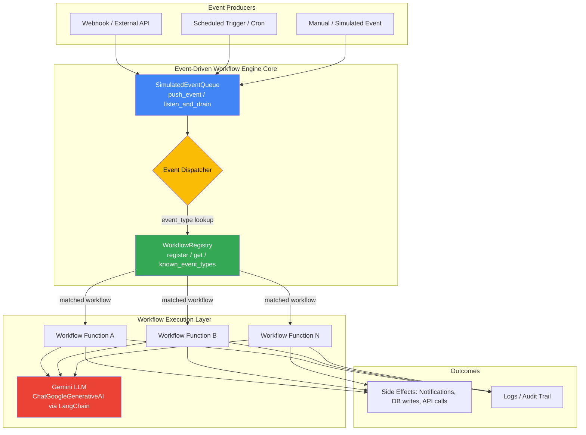
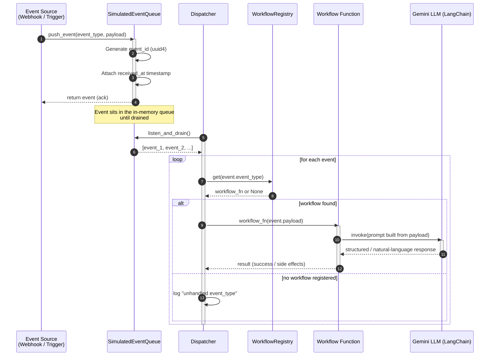
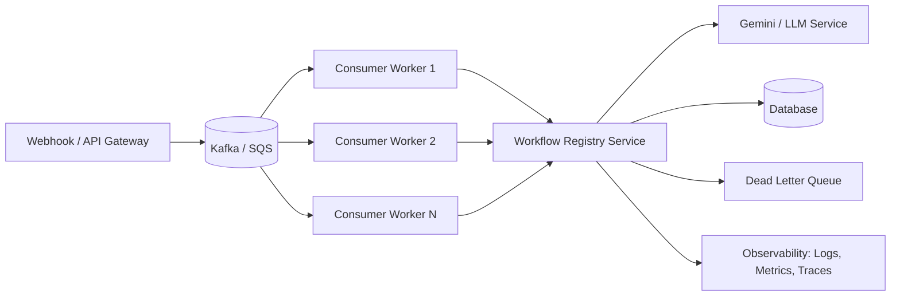

# ⚡ Event-Driven Workflow Engine

**A Python-based simulation of a modern event-driven automation system** — event queues, webhook-style listeners, a workflow registry, and an LLM-powered decision layer (Google Gemini via LangChain) built from first principles to demonstrate how real production systems like AWS EventBridge, Kafka consumers, Temporal, and n8n work under the hood.

<p align="left">
  
  
  
  
  
</p>

> **Repository:** [`techakash32/Event-Driven-Workflow-Engine`](https://github.com/techakash32/Event-Driven-Workflow-Engine)
> **Author:** Akash Nagar

---

## 📑 Table of Contents

1. [Project Overview](#-project-overview)
2. [Why This Project Matters](#-why-this-project-matters)
3. [System Architecture](#-system-architecture)
4. [Event Lifecycle](#-event-lifecycle)
5. [Workflow Execution Model](#-workflow-execution-model)
6. [Project Structure](#-project-structure)
7. [Installation & Setup](#-installation--setup)
8. [Usage Guide](#-usage-guide)
9. [Technology Stack](#-technology-stack)
10. [Code Walkthrough (Component by Component)](#-code-walkthrough-component-by-component)
11. [Design Patterns Used](#-design-patterns-used)
12. [Scalability & Production Considerations](#-scalability--production-considerations)
13. [Roadmap / Future Improvements](#-roadmap--future-improvements)
14. [Real-World Use Cases](#-real-world-use-cases)
15. [Interview Preparation — 40 Q&A](#-interview-preparation--40-qa)
16. [Contributing](#-contributing)
17. [License](#-license)

---

## 🧭 Project Overview

The **Event-Driven Workflow Engine** is a lightweight, educational-yet-extensible simulation of an event-driven automation platform, written in pure Python. It models the same core primitives that power tools like **Zapier, n8n, AWS EventBridge, Temporal, and Airflow**, but strips them down to their essence so that every moving part is visible and explainable:

- An **Event Queue** that receives and buffers events (simulating a message broker such as Kafka/SQS/RabbitMQ).
- A **Workflow Registry** that maps event types to the functions ("workflows") that should run when those events occur (the publish–subscribe pattern).
- A **Gemini LLM layer** (via LangChain's `ChatGoogleGenerativeAI`) that can be plugged into any workflow to add reasoning, classification, summarization, or decision-making on top of raw event data.
- A clean **entry point** (`main.py`) that wires these components together and boots the system.

The project is intentionally built in layers — beginners can read `main.py` top to bottom and understand exactly how an event goes from "received" to "handled," while advanced readers can use it as a scaffold to bolt on a real broker (Kafka/Redis), a persistent workflow store, retries, and horizontal scaling.

### What problem does it solve?

Traditional request/response systems couple the *producer* of an action (a user click, an API call, a file upload) directly to the *consumer* that reacts to it. That coupling makes systems brittle, hard to scale, and hard to extend. This project demonstrates the inversion: **producers only emit events; consumers (workflows) subscribe independently.** Adding a new reaction to an existing event never requires touching the code that raised the event in the first place — a core tenet of Event-Driven Architecture (EDA).

---

## 💡 Why This Project Matters

| Angle | What it demonstrates |
|---|---|
| **System Design** | Decoupled producer/consumer architecture, the backbone of every modern distributed system |
| **Software Engineering** | Clean class design, single-responsibility components, registry/factory patterns |
| **AI Engineering** | Practical integration of an LLM (Gemini) into an automation pipeline via LangChain |
| **Interview Readiness** | Talking points for EDA, queues, webhooks, workflow engines — common in SDE/Backend/AI interviews |
| **Extensibility** | A minimal core that can grow into a Kafka-backed, horizontally scaled orchestration service |

---

## 🏗 System Architecture

At a high level, the engine has four cooperating components: an **Event Source** (webhook/API/simulated trigger), the **Event Queue**, the **Workflow Registry**, and the **Workflow Executors** (optionally calling the **Gemini LLM**) that do the actual work.



**Reading the diagram:**
1. Any producer (a webhook call, a cron job, or a manually simulated trigger) calls `push_event()` on the queue.
2. The dispatcher drains the queue and, for each event, looks up the matching workflow(s) in the `WorkflowRegistry` by `event_type`.
3. The matched workflow function executes — optionally calling the Gemini LLM for reasoning, classification, or content generation.
4. The workflow produces side effects (writing to a database, sending a notification, calling another API) and/or logs.

---

## 🔄 Event Lifecycle

Every event in the system passes through five well-defined stages: **Emit → Queue → Dispatch → Execute → Complete**. The sequence diagram below traces a single event end-to-end.



**Lifecycle stages explained:**

| Stage | Component | Responsibility |
|---|---|---|
| **1. Emit** | Producer (webhook/trigger) | Something happens in the world and is translated into a structured event |
| **2. Queue** | `SimulatedEventQueue` | Event is buffered with a unique `event_id` and timestamp; decouples producer from consumer in time |
| **3. Dispatch** | Dispatcher loop | Queue is drained and each event is routed by `event_type` |
| **4. Execute** | `WorkflowRegistry` + workflow function | The correct handler is looked up and invoked, optionally reasoning via Gemini |
| **5. Complete** | Workflow function | Side effects are produced (logs, notifications, downstream calls) and the event is considered handled |

---

## ⚙️ Workflow Execution Model

A **workflow** in this engine is simply a Python callable registered against an `event_type` string. This is the classic **publish–subscribe** model:

```python
def handle_new_signup(payload: dict) -> None:
    """Workflow triggered when a 'user.signup' event occurs."""
    print(f"Welcoming new user: {payload.get('email')}")
    # e.g. call llm.invoke(...) to draft a personalized welcome message

workflow_registry.register("user.signup", handle_new_signup)
```

When an event with `event_type == "user.signup"` is drained from the queue, the dispatcher calls `workflow_registry.get("user.signup")`, receives `handle_new_signup`, and executes it with the event's `payload`. Because the registry is a simple dictionary lookup, execution is **O(1)** regardless of how many workflows are registered.

### One event, many workflows

Real systems often need to react to the same event in multiple independent ways (e.g., "order.placed" should both send a confirmation email *and* update inventory). The registry can be extended from a single-function map to a **list of subscribers per event type**, which is exactly how production pub/sub systems (SNS fan-out, Kafka consumer groups) behave — see [Roadmap](#-roadmap--future-improvements).

---

## 📁 Project Structure

```
Event-Driven-Workflow-Engine/
├── main.py               # Core engine: event queue, workflow registry, LLM setup, entry point
├── requirements.txt       # Python dependencies (langchain, langchain-google-genai, etc.)
├── pyproject.toml         # Project metadata / packaging configuration
├── .python-version        # Pinned Python version for consistent environments
├── .gitignore              # Excludes .env, __pycache__, virtual envs, etc.
└── README.md               # Project documentation (this file)
```

| File | Purpose |
|---|---|
| `main.py` | Contains `SimulatedEventQueue`, `WorkflowRegistry`, Gemini LLM initialization, and the `main()` entry point |
| `requirements.txt` | Pinned/loose dependency list installed via `pip install -r requirements.txt` |
| `pyproject.toml` | Modern Python packaging metadata (build system, project name, version) |
| `.python-version` | Ensures tools like `pyenv` select the correct interpreter version |
| `.env` *(not committed)* | Holds `GOOGLE_API_KEY` — loaded via `python-dotenv` |

---

## 🛠 Installation & Setup

### Prerequisites

- Python **3.10+**
- A **Google AI Studio API key** for Gemini ([get one here](https://aistudio.google.com/apikey))
- `pip` or `uv` for dependency management

### Step-by-step

```bash
# 1. Clone the repository
git clone https://github.com/techakash32/Event-Driven-Workflow-Engine.git
cd Event-Driven-Workflow-Engine

# 2. Create and activate a virtual environment
python -m venv venv
source venv/bin/activate        # macOS / Linux
venv\Scripts\activate           # Windows

# 3. Install dependencies
pip install -r requirements.txt

# 4. Configure your environment variables
echo "GOOGLE_API_KEY=your_api_key_here" > .env

# 5. Run the engine
python main.py
```

### Expected output

```
✅ Event Queue Initialized
✅ Workflow Registry Initialized
✅ Gemini LLM Connected

===============================
 Event-Driven Workflow Engine
===============================

System Ready 🚀
```

---

## 📘 Usage Guide

### 1. Emitting an event

```python
from main import event_queue

event_queue.push_event(
    event_type="user.signup",
    payload={"email": "akash@example.com", "plan": "pro"},
)
```

### 2. Registering a workflow

```python
from main import workflow_registry, llm

def handle_signup(payload: dict) -> str:
    prompt = f"Write a one-line welcome message for {payload['email']}"
    response = llm.invoke(prompt)
    print(response.content)
    return response.content

workflow_registry.register("user.signup", handle_signup)
```

### 3. Draining and dispatching events (extension pattern)

The shipped engine exposes the primitives (`push_event`, `listen_and_drain`, `register`, `get`) needed to build a dispatcher loop. A minimal dispatcher looks like this:

```python
def dispatch_all():
    """Drain the queue and run any matched workflow for each event."""
    for event in event_queue.listen_and_drain():
        workflow_fn = workflow_registry.get(event["event_type"])
        if workflow_fn:
            workflow_fn(event["payload"])
        else:
            print(f"[dispatcher] No workflow registered for '{event['event_type']}'")

# Example run
event_queue.push_event("user.signup", {"email": "new.user@example.com"})
dispatch_all()
```

This mirrors exactly how a real consumer loop works against Kafka, SQS, or RabbitMQ: **pull → match → execute → acknowledge.**

---

## 🧩 Technology Stack

| Layer | Technology | Role |
|---|---|---|
| Language | **Python 3.10+** | Core implementation language |
| LLM Orchestration | **LangChain** (`langchain`) | Abstraction layer for prompting, chaining, and tool use |
| LLM Provider | **Google Gemini** (`gemini-2.5-flash` via `langchain-google-genai`) | Reasoning / generation inside workflows |
| SDK | **google-generativeai** | Underlying Gemini SDK used by the LangChain integration |
| Data Handling | **pandas** | Structured data manipulation for workflow payloads |
| Config Management | **python-dotenv** | Loads `GOOGLE_API_KEY` and other secrets from `.env` |
| Concurrency Primitive | **`queue.Queue`** (standard library) | Thread-safe in-memory event buffer |
| Identifiers | **`uuid`** (standard library) | Generates unique `event_id` per event |
| Time Handling | **`datetime`** (standard library) | Timestamps each event on receipt |
| Packaging | **`pyproject.toml`** | Modern Python project metadata |

---

## 🔍 Code Walkthrough (Component by Component)

### `SimulatedEventQueue`

```python
class SimulatedEventQueue:
    def __init__(self):
        self._queue = queue.Queue()

    def push_event(self, event_type, payload, event_id=None):
        event = {
            "event_id": event_id or str(uuid.uuid4()),
            "event_type": event_type,
            "payload": payload,
            "received_at": datetime.now().strftime("%Y-%m-%d %H:%M:%S"),
        }
        self._queue.put(event)
        print(f"[Listener] Event Received | Type={event_type} | ID={event['event_id'][:8]}")
        return event

    def listen_and_drain(self):
        events = []
        while not self._queue.empty():
            events.append(self._queue.get())
        return events

    def is_empty(self):
        return self._queue.empty()
```

**What it does and why it's designed this way:**
- Wraps Python's built-in, **thread-safe** `queue.Queue` — the same primitive used to build producer/consumer pipelines and worker pools.
- `push_event` is the **write path**: it normalizes any incoming trigger into a consistent event envelope (`event_id`, `event_type`, `payload`, `received_at`), which is exactly what real message brokers do (Kafka message headers, SQS message attributes, CloudEvents spec).
- Generating `event_id` with `uuid.uuid4()` guarantees a globally unique, collision-resistant identifier without needing a central coordinator — critical in distributed systems.
- `listen_and_drain` is the **read path**: it fully empties the queue into a list, simulating a consumer "polling" a broker in batches (similar to `SQS.receive_message` with a batch size, or a Kafka `poll()` call).
- `is_empty` supports a polling loop (`while not queue.is_empty(): ...`) without needing to catch a `queue.Empty` exception.

### `WorkflowRegistry`

```python
class WorkflowRegistry:
    def __init__(self):
        self._workflows: Dict[str, Callable] = {}

    def register(self, event_type, workflow_fn):
        self._workflows[event_type] = workflow_fn
        print(f"[Registry] Registered workflow -> {event_type}")

    def get(self, event_type):
        return self._workflows.get(event_type)

    def known_event_types(self):
        return list(self._workflows.keys())
```

**What it does and why it's designed this way:**
- Implements the **publish–subscribe (observer) pattern** at the code level: producers never know which function will run — only the `event_type` string. This is the same decoupling principle behind `EventEmitter` in Node.js, Django signals, and AWS EventBridge rules.
- Uses a `Dict[str, Callable]` for **O(1) average-case lookup**, so dispatch latency stays flat no matter how many workflows are registered.
- `register()` behaves like a **factory registration table** — a common pattern for plugin systems (e.g., how Flask/FastAPI route decorators, or Django's admin registry, work under the hood).
- `known_event_types()` gives introspection — useful for building a health/status dashboard or validating that every emitted event has a subscriber.

### Gemini LLM Setup

```python
load_dotenv()
GOOGLE_API_KEY = os.getenv("GOOGLE_API_KEY")
if not GOOGLE_API_KEY:
    raise ValueError("GOOGLE_API_KEY not found inside .env file.")

llm = ChatGoogleGenerativeAI(model="gemini-2.5-flash", temperature=0.2)
```

**What it does and why it's designed this way:**
- `python-dotenv` keeps secrets **out of source control** — the `.env` file is git-ignored, following the [Twelve-Factor App](https://12factor.net/config) principle of storing config in the environment.
- Failing fast with a `ValueError` when the key is missing is a **defensive programming** practice: it's better to crash immediately at startup with a clear message than to fail confusingly deep inside a workflow later.
- `temperature=0.2` is a deliberate choice: low temperature favors **deterministic, consistent** outputs, which matters for automation workflows where reproducibility is more valuable than creative variance.
- `ChatGoogleGenerativeAI` is LangChain's standard chat-model interface, meaning the `llm` object is a drop-in replacement for any other LangChain-supported model (OpenAI, Anthropic, etc.) — the workflow code doesn't need to change if the model provider changes.

### `main()` — the entry point

```python
def main():
    print("Event-Driven Workflow Engine")
    print("System Ready 🚀")

if __name__ == "__main__":
    main()
```

**What it does and why it's designed this way:**
- Uses the standard `if __name__ == "__main__":` guard so `main.py` can be **safely imported** (e.g., `from main import event_queue`) without re-running the boot sequence — essential when other modules or tests need access to `event_queue` / `workflow_registry`.
- Keeps startup logic (module-level: queue/registry/LLM initialization) separate from the "business" entry point (`main()`), reflecting a clean separation between **wiring** and **execution**.

---

## 🧠 Design Patterns Used

| Pattern | Where It Appears | Why It's Used |
|---|---|---|
| **Publish–Subscribe (Observer)** | `WorkflowRegistry` + event dispatch | Decouples event producers from the code that reacts to them |
| **Registry Pattern** | `WorkflowRegistry._workflows` dict | Central lookup table mapping keys → behavior, enabling dynamic registration |
| **Producer–Consumer** | `SimulatedEventQueue` | Separates the rate/timing of event creation from event processing |
| **Facade** | `main.py` as a whole | Presents a simple, unified interface (`event_queue`, `workflow_registry`, `llm`) over several subsystems |
| **Dependency Injection (implicit)** | `llm` passed into workflow functions | Workflows depend on an abstraction (`ChatGoogleGenerativeAI`) rather than constructing their own LLM client |
| **Fail-Fast** | `GOOGLE_API_KEY` validation at import time | Surfaces configuration errors immediately instead of at runtime deep in a workflow |
| **Strategy Pattern (extension point)** | Each registered workflow function | Interchangeable "strategies" selected at runtime by `event_type` |

---

## 📈 Scalability & Production Considerations

The current implementation is intentionally in-memory and single-process — perfect for learning and prototyping, but it makes a few simplifying assumptions that a production deployment would need to address:

| Concern | Current Behavior | Production-Grade Approach |
|---|---|---|
| **Durability** | Events live in an in-memory `queue.Queue`; a crash loses unprocessed events | Back the queue with **Kafka, AWS SQS, RabbitMQ, or Redis Streams** for durability and replay |
| **Concurrency** | Single-threaded dispatch loop | Use a **worker pool** (multiprocessing, asyncio, or Celery workers) to process events in parallel |
| **Horizontal Scaling** | One process, one queue | Multiple consumer instances in a **consumer group** so events are load-balanced across workers |
| **Ordering guarantees** | FIFO within a single `queue.Queue` | Use **partition keys** (e.g., per-user ordering in Kafka) if strict ordering per entity is required |
| **Retry / Failure Handling** | None — an exception in a workflow simply propagates | Add **exponential backoff retries** and a **Dead Letter Queue (DLQ)** for poison messages |
| **Idempotency** | Not enforced | Store processed `event_id`s to guarantee **at-least-once → effectively-once** processing |
| **Observability** | `print()` statements | Structured logging, **distributed tracing** (OpenTelemetry), and metrics (Prometheus) per event/workflow |
| **Schema Evolution** | Plain `dict` payloads | Formal schemas (**Pydantic models**, JSON Schema, or Avro/Protobuf) with versioning |
| **LLM Cost/Latency** | Every workflow call is synchronous | Batch requests, cache repeated prompts, and consider async invocation (`llm.ainvoke`) |
| **Security** | API key in `.env` | Use a secrets manager (AWS Secrets Manager, GCP Secret Manager, Vault) in production |

### A production-shaped version of this architecture



---

## 🚀 Roadmap / Future Improvements

- [ ] **Dispatcher loop** — a continuously running `dispatch()` function that drains the queue and executes matched workflows automatically.
- [ ] **Multi-subscriber events** — allow multiple workflows to subscribe to the same `event_type` (true fan-out).
- [ ] **Real webhook receiver** — expose a FastAPI/Flask endpoint (`POST /webhook`) that pushes verified external payloads directly into `event_queue`.
- [ ] **Persistence layer** — swap `queue.Queue` for Redis Streams or SQLite-backed storage so events survive restarts.
- [ ] **Retry & Dead Letter Queue** — automatic retries with backoff, and a DLQ for events that repeatedly fail.
- [ ] **Async support** — `asyncio`-based queue and `llm.ainvoke()` for non-blocking, high-throughput processing.
- [ ] **Pydantic event schemas** — strongly-typed, validated event payloads instead of raw dicts.
- [ ] **Workflow chaining / DAGs** — allow one workflow's output to trigger a follow-up event (event chaining), similar to Airflow/Temporal.
- [ ] **Observability dashboard** — a simple Streamlit/FastAPI UI showing live queue depth, registered workflows, and execution history.
- [ ] **Unit & integration tests** — `pytest` suite covering the queue, registry, and end-to-end dispatch.
- [ ] **Dockerization** — a `Dockerfile` + `docker-compose.yml` for one-command local spin-up (engine + Redis/Kafka).
- [ ] **CI/CD pipeline** — GitHub Actions for linting, testing, and packaging on every push.

---

## 🌍 Real-World Use Cases

| Use Case | How This Engine's Pattern Applies |
|---|---|
| **SaaS onboarding automation** | `user.signup` event triggers welcome email, CRM record creation, and a Gemini-drafted personalized message |
| **E-commerce order pipeline** | `order.placed` fans out to inventory update, payment capture, and shipping-label generation workflows |
| **Customer support triage** | Incoming support ticket event is classified by Gemini (urgency/sentiment) and routed to the correct team workflow |
| **CI/CD automation** | `github.push` or `pull_request.opened` webhook events trigger build, test, and Gemini-generated PR summaries |
| **Fraud/anomaly detection** | `transaction.created` event is scored by an LLM/rules workflow, escalating to a review queue if suspicious |
| **IoT/telemetry processing** | Device events pushed into the queue are dispatched to monitoring, alerting, and anomaly-summary workflows |
| **Content moderation** | `content.uploaded` event triggers a Gemini-based classification workflow before publishing |
| **Marketing automation** | `campaign.triggered` events dispatch to segmentation, personalization (Gemini), and delivery workflows |

---

## 🎯 Interview Preparation — 40 Q&A

A curated set of questions spanning **Event-Driven Architecture, Queues & Webhooks, Workflow Engines, Python, LangChain & Gemini, and System Design/Scalability** — the exact areas this project touches.

### A. Event-Driven Architecture (EDA)

**1. What is Event-Driven Architecture, and how does it differ from request-response architecture?**
EDA is a design paradigm where components communicate by producing and consuming **events** — immutable records that something happened — rather than calling each other directly. In request-response, the caller blocks and waits for a synchronous reply, tightly coupling caller and callee. In EDA, the producer emits an event and moves on; one or more consumers react independently and asynchronously. This decoupling improves scalability, resilience, and extensibility, at the cost of eventual consistency and added complexity in tracing/debugging.

**2. What are the core components of an event-driven system?**
Event producers (sources), an event channel/broker (queue, topic, or bus), event consumers/handlers, and often an event schema/contract that all parties agree on. Optionally, a dispatcher/router determines which consumer(s) receive which events.

**3. What is the difference between an event and a message?**
A *message* is any data sent from one component to another (can be a command, a query, or an event). An *event* is a specific kind of message representing a fact that already happened (e.g., `order.placed`) — it is immutable and doesn't expect the receiver to do anything in particular, whereas a *command* (e.g., `PlaceOrder`) explicitly instructs an action.

**4. What is the Publish-Subscribe (Pub/Sub) pattern?**
Producers ("publishers") emit events to a named channel/topic without knowing who, if anyone, is listening. Consumers ("subscribers") register interest in a topic and receive every event published to it. This is exactly what `WorkflowRegistry.register(event_type, fn)` models: the publisher (`push_event`) doesn't know or care which workflow will run.

**5. What are the trade-offs of Event-Driven Architecture?**
*Pros:* loose coupling, independent scaling, resilience to partial failure, easier to add new consumers without touching producers. *Cons:* eventual consistency, harder end-to-end debugging/tracing, potential for message duplication or ordering issues, and increased operational complexity (need a broker, monitoring, DLQs).

**6. What is event sourcing, and how does it relate to EDA?**
Event sourcing stores the full history of state-changing events as the source of truth (rather than just the current state), and derives current state by replaying events. EDA is about how components communicate; event sourcing is about how state is *persisted* — they're often used together but are distinct concepts.

**7. What is the difference between orchestration and choreography in event-driven systems?**
*Orchestration* uses a central coordinator (like a workflow engine) that explicitly tells each service what to do and in what order. *Choreography* has no central brain — each service reacts to events independently and emits new events, and the overall flow "emerges" from those reactions. This project's `WorkflowRegistry` leans toward choreography (each workflow reacts independently to its event type), but could be extended into orchestration by having a controller sequence workflow calls explicitly.

**8. How would you guarantee exactly-once processing of an event?**
True exactly-once delivery is very hard in distributed systems; most real systems achieve **at-least-once delivery + idempotent processing**, which behaves like exactly-once from the consumer's perspective. This means tracking processed `event_id`s (e.g., in a database with a unique constraint) and skipping duplicates.

**9. What is a Dead Letter Queue (DLQ) and why is it important?**
A DLQ is a secondary queue where events that repeatedly fail processing are routed instead of being retried forever or silently dropped. It prevents "poison messages" from blocking the main queue and gives engineers a place to inspect and manually resolve failures.

**10. How do you handle event ordering in a distributed system?**
Standard queues often don't guarantee global ordering across partitions/consumers. The common solution is **partitioning by key** (e.g., all events for a given `user_id` go to the same partition), which guarantees order *within* that key while still allowing parallelism *across* keys.

---

### B. Queues, Message Brokers & Webhooks

**11. What is a message queue, and why use one instead of a direct function call?**
A message queue is a buffer that temporarily stores messages between producer and consumer, decoupling them in both time and space. Unlike a direct function call, the producer doesn't need the consumer to be available *right now* — this smooths out traffic spikes, enables retries, and allows independent scaling of producers and consumers.

**12. Explain the difference between `queue.Queue` (used in this project) and a distributed broker like Kafka or RabbitMQ.**
`queue.Queue` is an **in-process, thread-safe** data structure — it only works within a single Python process and is lost on crash/restart. Kafka/RabbitMQ/SQS are **networked, durable, distributed** brokers that persist messages to disk, support multiple consumers across machines, and survive process restarts. `queue.Queue` is perfect for simulating the *pattern*; a real broker is needed for production durability and scale.

**13. What is a webhook?**
A webhook is a user-defined HTTP callback: instead of your system repeatedly *polling* an external service for updates, that service *pushes* an HTTP POST request to a URL you provide whenever an event occurs. It's essentially "reverse API" — the external system becomes the client, and your endpoint becomes the server.

**14. How do you secure a webhook endpoint?**
Verify a **signature** sent in a request header (an HMAC of the payload using a shared secret) to confirm the request truly came from the expected sender and wasn't tampered with; enforce HTTPS; validate a timestamp to prevent replay attacks; and rate-limit/validate payload schema before processing.

**15. What is the difference between polling and webhooks?**
Polling means the consumer repeatedly asks "has anything changed?" on a schedule, wasting requests when nothing has happened and introducing latency up to the polling interval. Webhooks push data the instant an event occurs, giving near-real-time updates with far less wasted traffic — at the cost of needing a publicly reachable endpoint and delivery-retry logic.

**16. How would you make webhook processing idempotent?**
Include a unique event/delivery ID in every webhook payload (most providers already do, e.g., Stripe's `event.id`), store processed IDs, and skip any webhook whose ID has already been handled — since providers often retry webhook delivery on timeout, the same event can arrive more than once.

**17. What is backpressure, and how do queues help manage it?**
Backpressure occurs when a producer generates events faster than consumers can process them. Queues absorb this pressure by buffering events until consumers catch up; if the queue itself grows unbounded, you add flow control (bounded queue size, autoscaling consumers, or rejecting/throttling producers).

**18. What's the difference between `at-most-once`, `at-least-once`, and `exactly-once` delivery semantics?**
*At-most-once:* a message might be lost but is never duplicated (fire-and-forget). *At-least-once:* a message is guaranteed to be delivered but might be delivered more than once (requires idempotent consumers). *Exactly-once:* the hardest guarantee — the message is delivered and processed exactly one time; usually approximated via at-least-once + idempotency rather than achieved natively.

**19. Why might you choose SQS/RabbitMQ over Kafka for a given system (or vice versa)?**
SQS/RabbitMQ are traditional **message queues** — great for task distribution/work queues where each message should be processed once by one consumer. Kafka is a **distributed log** — great for high-throughput event streaming, replay, and when multiple independent consumer groups need to read the *same* event stream. Choice depends on whether you need simple task queuing (SQS/RabbitMQ) or a durable, replayable event log with high fan-out (Kafka).

**20. In this project, what real infrastructure would `SimulatedEventQueue` be replaced with in production, and why?**
It would be replaced with a durable broker such as **Kafka, AWS SQS, or Redis Streams**, because `queue.Queue` only exists in one process's memory — if that process crashes, all unprocessed events are lost, and it cannot be shared across multiple worker machines for horizontal scaling.

---

### C. Workflow Engines & Orchestration

**21. What is a workflow engine, and what problem does it solve?**
A workflow engine coordinates a sequence of steps (tasks) that may run in different services, in a defined order, often with retries, conditionals, and long-running/human-in-the-loop steps. It solves the problem of reliably executing multi-step business processes without hand-rolling brittle chains of callbacks or cron jobs.

**22. How does the `WorkflowRegistry` in this project resemble a router?**
Just like an HTTP router maps a URL path + method to a handler function, `WorkflowRegistry` maps an `event_type` string to a handler function. Both use a dictionary lookup for O(1) dispatch and both allow adding new routes/handlers without modifying the dispatch mechanism itself.

**23. What is the difference between a workflow and a single task/job?**
A task/job is one unit of work (e.g., "send an email"). A workflow is a composition of one or more tasks, potentially with branching logic, retries, delays, and dependencies between steps (e.g., "validate payment → THEN update inventory → THEN send confirmation").

**24. How would you add support for multi-step workflows (a DAG) to this engine?**
Represent each workflow as a list/graph of steps, where each step's output can conditionally emit a new event (chaining) or directly call the next step. A more robust approach is to track workflow *state* per `event_id`/`run_id` in a store, so a long-running workflow can pause and resume (similar to how Temporal or AWS Step Functions model state machines).

**25. What is idempotency in the context of workflow execution, and why does it matter here?**
A workflow is idempotent if running it multiple times with the same input produces the same result without unwanted side effects (e.g., not sending a duplicate welcome email). It matters because message brokers commonly offer at-least-once delivery, so any given event might trigger the same workflow more than once.

**26. How do you handle a workflow that partially fails (e.g., step 2 of 3 succeeds, step 3 fails)?**
Techniques include the **Saga pattern** (define compensating actions to undo completed steps if a later step fails), checkpointing progress so a retry resumes from the failed step rather than the start, and emitting explicit failure events so other parts of the system can react (e.g., alerting).

**27. What's the benefit of registering workflows dynamically (as this project does) versus hardcoding an if/elif chain?**
Dynamic registration is **open for extension, closed for modification** (the Open/Closed Principle): new event types and workflows can be added anywhere in the codebase without editing a central dispatch function, reducing merge conflicts and making the system a true plugin architecture.

---

### D. Python Concepts Used in This Project

**28. Why is `queue.Queue` thread-safe, and why does that matter here?**
`queue.Queue` uses internal locks to guard access to its underlying deque, so multiple threads can call `put()`/`get()` concurrently without corrupting internal state or losing items. This matters because a real event system typically has one thread/process receiving events (e.g., a webhook server) while another drains and processes them — `queue.Queue` handles that hand-off safely.

**29. What is the purpose of type hints like `Dict[str, Callable]` and `Optional[str]` in this codebase?**
They document the expected shape of data for both humans and tools (IDEs, static type checkers like `mypy`), catching bugs (e.g., passing a non-callable to `register`) before runtime, without changing Python's actual dynamic-typing behavior.

**30. Why does the project use `uuid.uuid4()` instead of an incrementing integer for `event_id`?**
`uuid4()` generates a random 128-bit identifier that is (practically) globally unique **without coordination** between processes or machines. An incrementing integer requires a single shared counter, which becomes a bottleneck and single point of failure in a distributed system with multiple producers.

**31. What does `if __name__ == "__main__":` do, and why is it used in `main.py`?**
It ensures the code inside only runs when the file is executed directly (`python main.py`), not when it's imported as a module elsewhere (`from main import event_queue`). This lets other code reuse `event_queue`, `workflow_registry`, and `llm` without triggering the CLI-style boot sequence.

**32. Why use `.get(event_type)` instead of `self._workflows[event_type]` in `WorkflowRegistry.get`?**
`dict.get()` returns `None` (or a specified default) if the key is missing, instead of raising a `KeyError`. This lets the dispatcher gracefully handle "no workflow registered for this event" instead of crashing the whole dispatch loop.

**33. What's the difference between a `list` and a `dict` for the `_workflows` registry, and why was `dict` chosen?**
A `dict` gives **O(1)** average-time lookup by key (`event_type`), while a `list` would require an **O(n)** linear scan to find a matching entry. Since dispatch happens on every single event, dictionary lookup keeps the system fast regardless of how many workflows are registered.

**34. Why does the code load environment variables with `python-dotenv` instead of hardcoding the API key?**
Hardcoding secrets in source code risks leaking them via version control (git history, public repos) and makes rotating keys painful. `.env` + `python-dotenv` keeps secrets outside the codebase, environment-specific, and easy to rotate without a code change.

---

### E. LangChain, Google Gemini & LLM Integration

**35. What role does LangChain play in this project, given that Google already provides a Gemini SDK?**
LangChain provides a **standardized abstraction** (`ChatGoogleGenerativeAI`) over multiple LLM providers, so workflow code written against the LangChain interface (`llm.invoke(...)`) doesn't need to change if the underlying model provider is swapped (e.g., to OpenAI or Anthropic). It also offers building blocks — prompt templates, chains, memory, tools/agents — that go beyond a raw SDK call.

**36. Why is `temperature=0.2` chosen for the Gemini model in this project instead of a higher value like 0.9?**
Low temperature biases the model toward the most probable, consistent tokens, producing more deterministic and repeatable output — desirable for **automation workflows** (e.g., classifying an event or extracting structured data) where reliability matters more than creative variety.

**37. How would you use Gemini to make a workflow "smarter" in this engine — give a concrete example?**
For a `support.ticket_created` event, a workflow could call `llm.invoke()` with the ticket text and ask Gemini to classify urgency and sentiment, returning a structured label used to route the ticket to the right team — turning a purely mechanical dispatch system into one capable of semantic decision-making.

**38. What's the difference between `llm.invoke()` and `llm.ainvoke()`, and when would you use the async version?**
`invoke()` is synchronous and blocks the calling thread until the model responds. `ainvoke()` is the `async`/`await` version, letting the event loop process other work (like draining more events) while waiting on the network round-trip to Gemini — important for high-throughput, low-latency dispatch loops.

**39. What risks does directly feeding webhook/event payloads into an LLM prompt introduce, and how would you mitigate them?**
Untrusted payload content could contain **prompt injection** attempts trying to manipulate the model's behavior, or sensitive PII that shouldn't be sent to a third-party API. Mitigations include sanitizing/validating input before it reaches the prompt, using structured (not free-text) prompt templates, and redacting sensitive fields.

**40. How would you keep LLM costs and latency under control as event volume grows?**
Cache responses for repeated/similar inputs, batch multiple events into a single prompt where possible, use a smaller/faster model (like `gemini-2.5-flash` rather than a heavier "pro" model, exactly as this project does) for high-volume simple tasks, and reserve larger models only for cases that genuinely need deeper reasoning.

---

## 🤝 Contributing

Contributions are welcome. If you'd like to extend the engine (e.g., add the dispatcher loop, a real webhook receiver, or async support from the [Roadmap](#-roadmap--future-improvements)):

1. Fork the repository
2. Create a feature branch: `git checkout -b feature/dispatcher-loop`
3. Commit your changes with clear messages
4. Open a Pull Request describing the change and its motivation

---

## 📄 License

This project is licensed under the **MIT License** — see the `LICENSE` file for details.

---

## 👤 Author

**Akash Nagar**
Aspiring AI/ML Engineer & Data Science Professional
Building this project as part of a portfolio focused on **AI-integrated backend systems**, event-driven design, and production-minded engineering practices.
